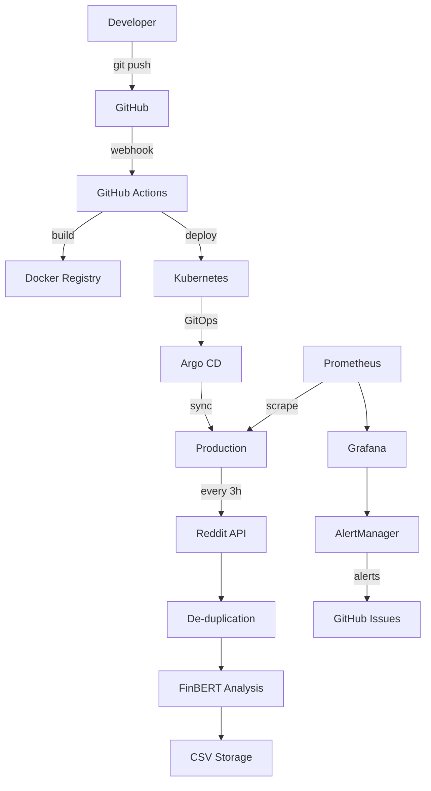

# Reddit Sentiment Analysis Pipeline

[](https://github.com/YasCay/cicd_project/actions/workflows/ci.yml)
[](https://github.com/YasCay/cicd_project/actions/workflows/security.yml)
[](https://opensource.org/licenses/MIT)

A **production-ready, GitOps-driven sentiment analysis pipeline** that automatically fetches Reddit posts every 3 hours, performs intelligent de-duplication, analyzes sentiment using FinBERT (Financial BERT), and stores results in structured CSV format. Built with enterprise-grade monitoring, alerting, and deployment automation.

## Overview

This project demonstrates a complete MLOps pipeline with:
- **Real-time Data Collection**: Automated Reddit API integration
- **ML-Driven Analysis**: FinBERT sentiment scoring for financial content  
- **Production Infrastructure**: Docker, Kubernetes, and GitOps deployment
- **Enterprise Monitoring**: Prometheus metrics, Grafana dashboards, and alerting
- **Security & Compliance**: Vulnerability scanning, secrets management, and audit trails

### Key Statistics
- **98% Test Coverage** across 68+ comprehensive test cases
- **Sub-second Processing** with optimized batch sentiment analysis
- **Zero-downtime Deployment** via Kubernetes rolling updates
- **24/7 Monitoring** with automated incident response

## Features

### 🔄 **Automated Data Pipeline**
- **Reddit API Integration**: Multi-subreddit post collection using PRAW
- **Smart De-duplication**: Bloom filter + SQLite for 99.9% duplicate elimination
- **Batch Processing**: Configurable batch sizes for optimal throughput
- **Error Recovery**: Graceful handling of API rate limits and network issues

### 🧠 **ML-Powered Sentiment Analysis**
- **FinBERT Integration**: Financial domain-specific BERT model (ProsusAI/finbert)
- **Multi-Device Support**: Automatic CUDA/MPS/CPU device selection
- **Token Management**: Intelligent text truncation for BERT's 512-token limit
- **Confidence Scoring**: Probabilistic sentiment scores with confidence intervals

### 🚀 **Production-Ready Infrastructure**
- **Container Orchestration**: Docker + Kubernetes with Helm charts
- **GitOps Deployment**: Argo CD for automated deployments
- **CI/CD Pipeline**: GitHub Actions with security scanning and quality gates
- **Service Mesh Ready**: Istio/Linkerd compatible service definitions

### 📊 **Enterprise Monitoring**
- **Prometheus Metrics**: 14+ custom metrics for pipeline performance
- **Grafana Dashboards**: Real-time visualization and alerting
- **Health Checks**: Multi-layer health monitoring (/health, /metrics endpoints)
- **Log Aggregation**: Structured logging with ELK stack compatibility

## Architecture




### System Components
- **Data Ingestion**: Reddit API client with rate limiting
- **Processing Engine**: Python-based sentiment analysis pipeline
- **Storage Layer**: SQLite for metadata, CSV for results
- **Monitoring Stack**: Prometheus + Grafana + AlertManager
- **Deployment Platform**: Kubernetes with Helm + Argo CD

## Quick Start

### Prerequisites
- Python 3.9+ 
- Docker and Docker Compose
- Reddit API credentials ([Get them here](https://www.reddit.com/prefs/apps))
- 8GB+ RAM (for FinBERT model)

### 1. Clone and Setup
```bash
git clone https://github.com/YasCay/cicd_project.git
cd cicd_project

# Copy environment template
cp .env.example .env
# Edit .env with your Reddit API credentials
```

### 2. Local Development
```bash
# Create virtual environment
python -m venv venv
source venv/bin/activate  # Windows: venv\Scripts\activate

# Install dependencies
pip install --upgrade pip
pip install -r apps/collector/requirements.txt

# Run tests
pytest -v --cov=apps/collector

# Start local pipeline
python apps/collector/collector.py
```

### 3. Docker Deployment
```bash
# Build and run with Docker Compose
docker-compose up -d

# View logs
docker-compose logs -f reddit-sentiment

# Access monitoring
open http://localhost:3000  # Grafana (admin/admin)
open http://localhost:9090  # Prometheus
```

### 4. Production Deployment
```bash
# Deploy to Kubernetes
helm install reddit-sentiment helm/reddit-sentiment-pipeline/ \
  --set reddit.clientId=YOUR_CLIENT_ID \
  --set reddit.clientSecret=YOUR_CLIENT_SECRET

# Monitor deployment
kubectl get pods -l app=reddit-sentiment
kubectl logs -f deployment/reddit-sentiment
```

## Installation

### Development Environment

1. **System Requirements**
   ```bash
   # Ubuntu/Debian
   sudo apt update && sudo apt install -y python3.9 python3.9-venv python3.9-dev git

   # macOS
   brew install python@3.9 git

   # Windows (PowerShell as Administrator)
   choco install python39 git
   ```

2. **Project Setup**
   ```bash
   git clone https://github.com/YasCay/cicd_project.git
   cd cicd_project
   python3.9 -m venv venv
   source venv/bin/activate
   pip install --upgrade pip setuptools wheel
   pip install -r apps/collector/requirements.txt
   ```

3. **Reddit API Configuration**
   - Visit [Reddit App Preferences](https://www.reddit.com/prefs/apps)
   - Click "Create App" → "script" type
   - Copy client ID and secret to `.env` file

### Production Environment

1. **Kubernetes Cluster**
   ```bash
   # Install kubectl and helm
   curl -LO "https://dl.k8s.io/release/$(curl -L -s https://dl.k8s.io/release/stable.txt)/bin/linux/amd64/kubectl"
   curl https://raw.githubusercontent.com/helm/helm/main/scripts/get-helm-3 | bash
   ```

2. **Monitoring Stack**
   ```bash
   # Install Prometheus Operator
   helm repo add prometheus-community https://prometheus-community.github.io/helm-charts
   helm install monitoring prometheus-community/kube-prometheus-stack
   ```

3. **GitOps with Argo CD**
   ```bash
   # Install Argo CD
   kubectl create namespace argocd
   kubectl apply -n argocd -f https://raw.githubusercontent.com/argoproj/argo-cd/stable/manifests/install.yaml
   ```

## Configuration

### Environment Variables

| Variable | Description | Default | Required |
|----------|-------------|---------|----------|
| `REDDIT_CLIENT_ID` | Reddit API client ID | - | ✅ |
| `REDDIT_CLIENT_SECRET` | Reddit API client secret | - | ✅ |
| `REDDIT_USER_AGENT` | Reddit API user agent | `reddit-sentiment-pipeline` | ❌ |
| `SUBREDDITS` | Comma-separated subreddit list | `CryptoCurrency,Bitcoin,ethereum` | ❌ |
| `POSTS_LIMIT` | Posts to fetch per subreddit | `100` | ❌ |
| `ENABLE_SENTIMENT` | Enable FinBERT analysis | `true` | ❌ |
| `FINBERT_MODEL` | HuggingFace model name | `ProsusAI/finbert` | ❌ |
| `SENTIMENT_BATCH_SIZE` | Batch size for sentiment analysis | `8` | ❌ |
| `DEDUP_CAPACITY` | Bloom filter capacity | `100000` | ❌ |
| `OUTPUT_DIR` | Results output directory | `data/` | ❌ |
| `LOG_LEVEL` | Logging level | `INFO` | ❌ |

### Advanced Configuration

#### Sentiment Analysis Tuning
```env
# Model Performance
FINBERT_MODEL=ProsusAI/finbert  # or nlptown/bert-base-multilingual-uncased-sentiment
SENTIMENT_BATCH_SIZE=16         # Larger for GPU, smaller for CPU
MAX_TOKEN_LENGTH=512            # BERT's maximum context length

# Device Selection
CUDA_VISIBLE_DEVICES=0          # GPU selection
PYTORCH_MPS_HIGH_WATERMARK_RATIO=0.0  # macOS Metal Performance
```

#### De-duplication Settings
```env
DEDUP_CAPACITY=100000           # Bloom filter capacity
DEDUP_ERROR_RATE=0.001          # False positive rate (0.1%)
DEDUP_DB_PATH=data/dedup.db     # SQLite database location
```

#### Monitoring Configuration
```env
METRICS_PORT=8000               # Prometheus metrics endpoint
HEALTH_CHECK_PORT=8001          # Health check endpoint  
ENABLE_METRICS=true             # Enable metrics collection
METRICS_PREFIX=reddit_sentiment # Metric name prefix
```

## Usage

### Basic Pipeline Execution

```bash
# Run once
python apps/collector/collector.py

# Run with custom configuration
SUBREDDITS="wallstreetbets,stocks" POSTS_LIMIT=50 python apps/collector/collector.py

# Run with sentiment analysis disabled
ENABLE_SENTIMENT=false python apps/collector/collector.py
```

### Scheduled Execution

#### Using Cron (Linux/macOS)
```bash
# Add to crontab for 3-hour execution
crontab -e

# Run every 3 hours
0 */3 * * * cd /path/to/cicd_project && /path/to/venv/bin/python apps/collector/collector.py
```

#### Using systemd Timer (Linux)
```bash
# Copy service files
sudo cp systemd/reddit-sentiment-pipeline.* /etc/systemd/system/

# Enable and start
sudo systemctl daemon-reload
sudo systemctl enable reddit-sentiment-pipeline.timer
sudo systemctl start reddit-sentiment-pipeline.timer

# Check status
sudo systemctl status reddit-sentiment-pipeline.timer
```

#### Using Docker Compose
```bash
# Run as background service
docker-compose up -d

# Scale for high throughput
docker-compose up -d --scale reddit-sentiment=3
```

### Data Analysis

#### CSV Output Format
```csv
post_id,subreddit,title,score,num_comments,created_utc,sentiment_label,sentiment_score,sentiment_confidence,processed_at
abc123,CryptoCurrency,"Bitcoin hits new ATH!",1500,200,1640995200,positive,0.85,0.92,2024-01-01T12:00:00Z
```

#### Programmatic Access
```python
from apps.collector.collector import RedditCollector
from apps.collector.sentiment import SentimentAnalyzer

# Initialize components
collector = RedditCollector()
analyzer = SentimentAnalyzer()

# Fetch and analyze
posts = collector.fetch_posts(['CryptoCurrency'], limit=10)
results = analyzer.analyze_sentiment_batch(posts)

# Process results
for post, sentiment in zip(posts, results):
    print(f"{post['title']}: {sentiment['label']} ({sentiment['score']:.2f})")
```

## API Documentation

### Health Check Endpoints

#### `GET /health`
Returns overall system health status.

**Response:**
```json
{
  "status": "healthy",
  "timestamp": "2024-01-01T12:00:00Z",
  "version": "1.0.0",
  "components": {
    "reddit_api": "healthy",
    "sentiment_model": "healthy", 
    "database": "healthy",
    "disk_space": "healthy"
  }
}
```

#### `GET /health/database`
Database connectivity check.

**Response:**
```json
{
  "status": "healthy",
  "database_size": "1.2MB",
  "total_posts": 1543,
  "last_update": "2024-01-01T11:30:00Z"
}
```

#### `GET /health/reddit-api`
Reddit API connectivity and rate limit status.

**Response:**
```json
{
  "status": "healthy",
  "rate_limit_remaining": 58,
  "rate_limit_reset": "2024-01-01T12:15:00Z",
  "last_successful_call": "2024-01-01T11:59:30Z"
}
```

#### `GET /health/sentiment-model`
FinBERT model status and performance.

**Response:**
```json
{
  "status": "healthy",
  "model_name": "ProsusAI/finbert",
  "device": "cuda:0",
  "last_analysis_time": "0.85s",
  "model_memory_usage": "1.2GB"
}
```

### Metrics Endpoint

#### `GET /metrics`
Prometheus-compatible metrics for monitoring.

**Key Metrics:**
- `reddit_posts_fetched_total`: Total posts fetched by subreddit
- `reddit_posts_processed_total`: Successfully processed posts
- `reddit_api_requests_total`: Reddit API requests with status
- `sentiment_analysis_duration_seconds`: Analysis latency histogram
- `sentiment_batch_size`: Batch size distribution
- `deduplication_hits_total`: Duplicate posts detected
- `pipeline_errors_total`: Errors by component and type

### Data Export API

#### POST `/export/csv`
Export sentiment analysis results in CSV format.

**Request Body:**
```json
{
  "start_date": "2024-01-01",
  "end_date": "2024-01-31",
  "subreddits": ["CryptoCurrency", "Bitcoin"],
  "sentiment_filter": "positive"
}
```

**Response:**
```csv
Content-Type: text/csv
Content-Disposition: attachment; filename="sentiment_export_20240101.csv"

post_id,subreddit,title,sentiment_label,sentiment_score,created_utc
...
```

## Monitoring

### Grafana Dashboard

Access the pre-configured dashboard at `http://localhost:3000` (admin/admin):

#### Overview Panel
- **Pipeline Status**: Real-time health indicator
- **Processing Rate**: Posts processed per hour
- **Error Rate**: Failed operations percentage
- **Sentiment Distribution**: Positive/Negative/Neutral breakdown

#### Performance Metrics
- **API Latency**: Reddit API response times
- **Sentiment Analysis Duration**: ML processing performance  
- **Memory Usage**: System resource consumption
- **Disk Usage**: Storage utilization trends

#### Alerts and Incidents
- **Active Alerts**: Current system alerts
- **Alert History**: Past 24h incident timeline
- **Error Logs**: Recent error patterns
- **SLA Compliance**: Uptime and performance SLAs

### Prometheus Queries

#### Essential Queries
```promql
# Processing rate (posts/hour)
rate(reddit_posts_processed_total[1h]) * 3600

# Error rate percentage
(rate(pipeline_errors_total[5m]) / rate(reddit_posts_fetched_total[5m])) * 100

# Sentiment analysis latency (95th percentile)
histogram_quantile(0.95, sentiment_analysis_duration_seconds_bucket)

# Memory usage trend
process_resident_memory_bytes / 1024 / 1024
```

#### Custom Alerts
```yaml
# High error rate alert
- alert: HighErrorRate
  expr: (rate(pipeline_errors_total[5m]) / rate(reddit_posts_fetched_total[5m])) * 100 > 5
  for: 2m
  labels:
    severity: warning
  annotations:
    summary: "High error rate detected"
    description: "Error rate is {{ $value }}% over 5 minutes"

# Service down alert  
- alert: ServiceDown
  expr: up{job="reddit-sentiment"} == 0
  for: 1m
  labels:
    severity: critical
  annotations:
    summary: "Reddit sentiment service is down"
```

### Alert Management

Alerts are automatically managed through:
- **AlertManager**: Routes alerts to appropriate channels
- **GitHub Issues**: Automatic issue creation for incidents
- **Escalation Policies**: Time-based severity escalation
- **Runbook Integration**: Automated response procedures

View active alerts: `http://localhost:9093` (AlertManager UI)

## Deployment

### Local Development Deployment

```bash
# Quick start with Docker Compose
docker-compose up -d

# Monitor logs
docker-compose logs -f reddit-sentiment

# Stop and cleanup
docker-compose down -v
```

### Staging Environment

```bash
# Deploy to local Kubernetes
kubectl create namespace reddit-sentiment-staging
helm install reddit-sentiment-staging helm/reddit-sentiment-pipeline/ \
  --namespace reddit-sentiment-staging \
  --set environment=staging \
  --set reddit.clientId=$REDDIT_CLIENT_ID \
  --set reddit.clientSecret=$REDDIT_CLIENT_SECRET

# Verify deployment
kubectl get pods -n reddit-sentiment-staging
kubectl logs -f deployment/reddit-sentiment -n reddit-sentiment-staging
```

### Production Deployment

#### Prerequisites
- Kubernetes cluster (1.20+)
- Helm 3.0+
- Argo CD installed
- Secrets configured

#### GitOps Deployment with Argo CD

1. **Configure Application**
   ```bash
   kubectl apply -f argocd/application.yaml
   ```

2. **Sync Application**
   ```bash
   argocd app sync reddit-sentiment-pipeline
   argocd app wait reddit-sentiment-pipeline --timeout 300
   ```

3. **Verify Deployment**
   ```bash
   kubectl get pods -l app=reddit-sentiment
   kubectl get ingress reddit-sentiment
   curl http://reddit-sentiment.example.com/health
   ```

#### Manual Helm Deployment

```bash
# Add secrets
kubectl create secret generic reddit-credentials \
  --from-literal=client-id=$REDDIT_CLIENT_ID \
  --from-literal=client-secret=$REDDIT_CLIENT_SECRET

# Deploy with production values
helm install reddit-sentiment helm/reddit-sentiment-pipeline/ \
  --namespace production \
  --values helm/reddit-sentiment-pipeline/values-production.yaml \
  --set image.tag=$BUILD_TAG

# Enable monitoring
helm install monitoring prometheus-community/kube-prometheus-stack \
  --namespace monitoring \
  --create-namespace
```

#### Blue-Green Deployment

```bash
# Deploy to blue environment
helm install reddit-sentiment-blue helm/reddit-sentiment-pipeline/ \
  --set environment=blue \
  --set image.tag=$NEW_VERSION

# Test blue environment
kubectl port-forward service/reddit-sentiment-blue 8080:80
curl http://localhost:8080/health

# Switch traffic to blue
kubectl patch service reddit-sentiment -p '{"spec":{"selector":{"version":"blue"}}}'

# Remove green environment
helm uninstall reddit-sentiment-green
```

### Server Deployment (Traditional)

For deployment to traditional servers like `/home/cayir/cicd_project`:

```bash
# Automated deployment script
./scripts/deploy_production.sh

# Manual deployment
ssh user@server 'cd /home/cayir/cicd_project && git pull && ./scripts/setup_production_env.sh'

# Verify systemd services
ssh user@server 'systemctl status reddit-sentiment-pipeline'
```

## Troubleshooting

### Common Issues

#### 1. Reddit API Authentication Failures
**Symptoms**: `PRAW Authentication Failed` errors

**Solutions:**
```bash
# Verify credentials
python -c "
import os
from apps.collector.collector import RedditCollector
os.environ['REDDIT_CLIENT_ID'] = 'your_id'  
os.environ['REDDIT_CLIENT_SECRET'] = 'your_secret'
collector = RedditCollector()
print('Authentication successful!')
"

# Check rate limits
curl -H "Authorization: bearer $REDDIT_TOKEN" https://oauth.reddit.com/api/v1/me

# Reset credentials
rm -f ~/.praw.ini
cp .env.example .env
# Edit .env with fresh credentials
```

#### 2. FinBERT Model Loading Issues  
**Symptoms**: `OSError: Can't load model` or CUDA out of memory

**Solutions:**
```bash
# Check available memory
free -h
nvidia-smi  # For GPU

# Reduce batch size
export SENTIMENT_BATCH_SIZE=4

# Use CPU-only mode
export CUDA_VISIBLE_DEVICES=""

# Clear model cache
rm -rf ~/.cache/huggingface/

# Test model loading
python -c "
from transformers import AutoTokenizer, AutoModelForSequenceClassification
model = AutoModelForSequenceClassification.from_pretrained('ProsusAI/finbert')
print('Model loaded successfully!')
"
```

#### 3. Database Lock Errors
**Symptoms**: `database is locked` SQLite errors

**Solutions:**
```bash
# Check for zombie processes
ps aux | grep python | grep collector

# Kill hanging processes  
pkill -f "python apps/collector/collector.py"

# Check database integrity
sqlite3 data/reddit_sentiment.db "PRAGMA integrity_check;"

# Reset database (WARNING: loses data)
rm data/reddit_sentiment.db
python apps/collector/collector.py  # Recreates DB
```

#### 4. Docker Container Issues
**Symptoms**: Container crashes or OOM kills

**Solutions:**
```bash
# Check container logs
docker logs reddit-sentiment-pipeline

# Increase memory limits
docker run --memory=4g reddit-sentiment-pipeline

# Check resource usage
docker stats reddit-sentiment-pipeline

# Debug inside container
docker exec -it reddit-sentiment-pipeline /bin/bash
```

#### 5. Kubernetes Deployment Problems
**Symptoms**: Pods stuck in Pending/CrashLoopBackOff

**Solutions:**
```bash
# Check pod status
kubectl describe pod reddit-sentiment-xxx

# View logs
kubectl logs reddit-sentiment-xxx --previous

# Check resources
kubectl top nodes
kubectl top pods

# Debug with shell access
kubectl exec -it reddit-sentiment-xxx -- /bin/bash

# Check secrets
kubectl get secret reddit-credentials -o yaml
```

### Performance Optimization

#### Memory Optimization
```bash
# Monitor memory usage
watch -n 1 'free -h && ps aux --sort=-%mem | head -10'

# Reduce model memory (use smaller model)
export FINBERT_MODEL=nlptown/bert-base-multilingual-uncased-sentiment

# Enable CPU optimizations
export OMP_NUM_THREADS=4
export MKL_NUM_THREADS=4
```

#### CPU Optimization  
```bash
# Profile CPU usage
python -m cProfile -o profile.stats apps/collector/collector.py
python -m pstats profile.stats

# Enable parallel processing
export SENTIMENT_BATCH_SIZE=16
export TOKENIZERS_PARALLELISM=true

# Use CPU-optimized containers
docker build -f Dockerfile.cpu -t reddit-sentiment:cpu .
```

#### Network Optimization
```bash
# Check Reddit API latency
ping api.reddit.com
traceroute api.reddit.com

# Use connection pooling
export REQUESTS_POOL_CONNECTIONS=10
export REQUESTS_POOL_MAXSIZE=20

# Enable request caching
export ENABLE_REQUEST_CACHE=true
```

### Debug Mode

Enable comprehensive debugging:

```bash
export LOG_LEVEL=DEBUG
export ENABLE_PROFILING=true
export DEBUG_METRICS=true

python apps/collector/collector.py 2>&1 | tee debug.log
```

### Getting Help

1. **Check Documentation**: See `docs/` directory for detailed guides
2. **Search Issues**: Check [GitHub Issues](https://github.com/YasCay/cicd_project/issues)
3. **Monitoring Logs**: Check Grafana dashboard for system status
4. **Contact Support**: Create an issue with logs and system information

## Contributing

We welcome contributions! Please see our [Contributing Guide](CONTRIBUTING.md) for details.

### Development Workflow

1. **Fork and Clone**
   ```bash
   git clone https://github.com/your-username/cicd_project.git
   cd cicd_project
   ```

2. **Setup Development Environment**
   ```bash
   python -m venv venv
   source venv/bin/activate
   pip install -r requirements-dev.txt
   pre-commit install
   ```

3. **Create Feature Branch**
   ```bash
   git checkout -b feature/your-feature-name
   ```

4. **Make Changes and Test**
   ```bash
   # Make your changes
   pytest -v --cov=apps/collector
   flake8 apps/
   black apps/
   ```

5. **Submit Pull Request**
   ```bash
   git commit -m "feat: add your feature description"
   git push origin feature/your-feature-name
   # Create PR on GitHub
   ```

### Code Standards

- **Testing**: Maintain >90% test coverage
- **Formatting**: Use `black` for code formatting  
- **Linting**: Follow `flake8` guidelines
- **Documentation**: Add docstrings for all functions
- **Commits**: Use [Conventional Commits](https://conventionalcommits.org/)

### Release Process

1. **Version Bump**
   ```bash
   bump2version minor  # or major/patch
   ```

2. **Create Release**
   ```bash
   git tag v1.2.0
   git push origin v1.2.0
   ```

3. **GitHub Actions** automatically:
   - Builds and tests the release
   - Creates Docker images
   - Updates Helm charts
   - Deploys to staging

## License

This project is licensed under the MIT License - see the [LICENSE](LICENSE) file for details.

### Third-Party Licenses
- **PRAW**: BSD-2-Clause License
- **FinBERT**: Apache-2.0 License  
- **Transformers**: Apache-2.0 License
- **Prometheus Client**: Apache-2.0 License

---

**Built with ❤️ for the DevOps and ML community**

For questions, issues, or contributions, please visit our [GitHub repository](https://github.com/YasCay/cicd_project).
