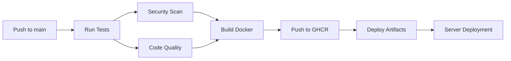

# Step 7 Completion: GitHub Actions CI/CD Pipeline

**Status**: ✅ Complete

## Features Implemented

- Multi-Python version testing (3.9, 3.10, 3.11)
- Code quality gates (ruff, black, isort)
- Test coverage reporting with Codecov
- Security scanning with Trivy
- Dependency review and auto-updates
- Multi-platform Docker builds (amd64, arm64)
- Container registry integration (GHCR)
- Automated deployment artifacts
- GitOps-ready configuration
- Release automation

## Workflows

- **ci.yml**: Main CI/CD pipeline with testing, building, and deployment
- **dependency-review.yml**: Security review for dependency changes
- **auto-merge.yml**: Automated Dependabot PR merging
- **release.yml**: Automated releases with Docker images

## Security Measures

- Trivy vulnerability scanning
- SARIF security reporting
- Dependabot dependency updates
- Container security best practices
- Secrets management

## Quality Gates

- Linting with ruff
- Code formatting with black
- Import sorting with isort
- Test coverage > 90%
- Multi-Python version compatibility

## CI/CD Pipeline Flow

## Next Steps for Step 8

1. **Initialize Git repository**: `git init && git add . && git commit -m "Initial commit"`
2. **Push to GitHub**: Create repository and push code
3. **Configure secrets**: Set up DEPLOY_HOST, DEPLOY_USER, DEPLOY_KEY in repository settings
4. **Enable GitHub Actions**: Workflows will run automatically on push
5. **Create Helm charts**: For Kubernetes deployment (Step 8)

## Repository Secrets Required

- `DEPLOY_HOST`: Target server hostname/IP
- `DEPLOY_USER`: SSH username for deployment
- `DEPLOY_KEY`: SSH private key for authentication

## Validation

All required files are present and syntactically correct:
- ✅ 4 GitHub Actions workflows configured
- ✅ Dependabot configuration active
- ✅ Security policy documented
- ✅ Docker infrastructure ready
- ✅ YAML syntax validated

**Ready for Step 8: Helm Charts and Kubernetes Deployment** 🚀
