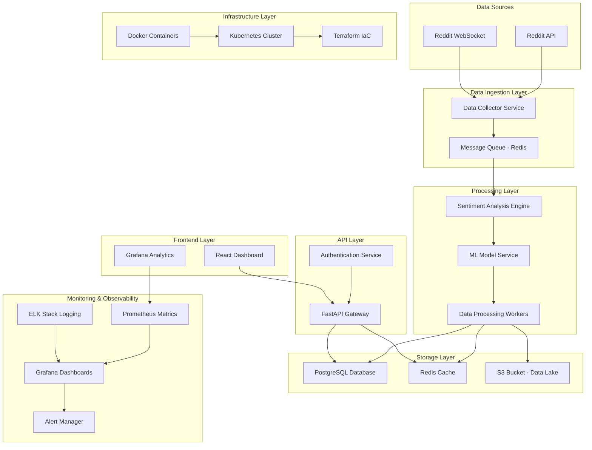
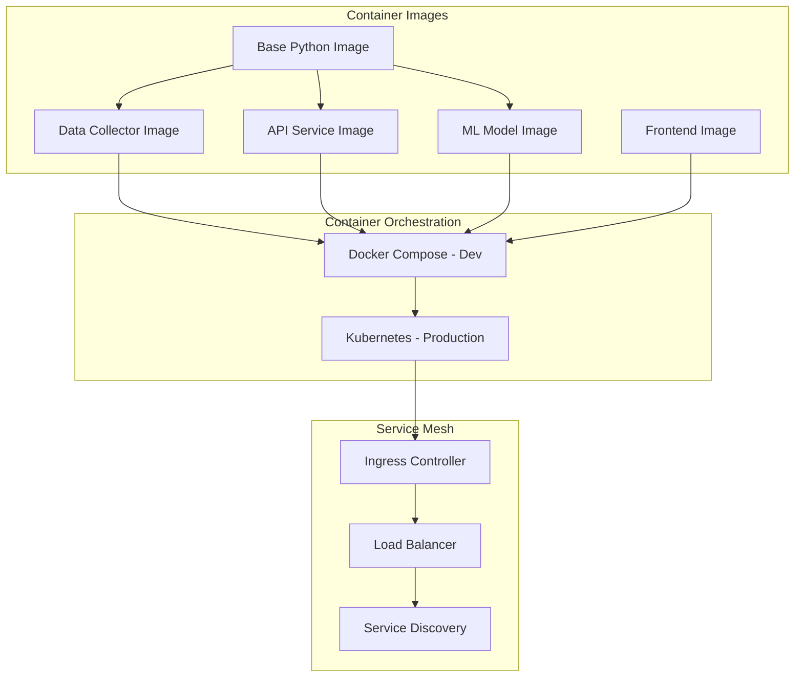
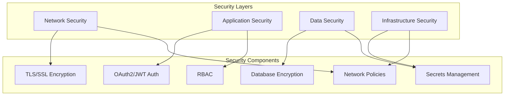
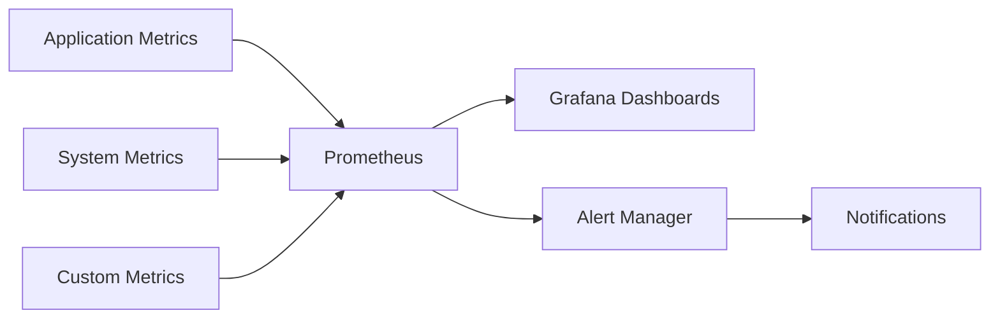
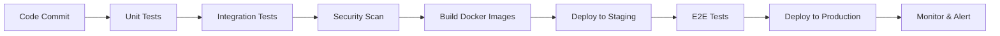

# Reddit Sentiment Analysis Pipeline - System Architecture

## Overview

The Reddit Sentiment Analysis Pipeline is a cloud-native, microservices-based system that automatically analyzes sentiment from Reddit posts and comments in real-time. The architecture follows modern DevOps practices with containerization, Infrastructure as Code (IaC), and comprehensive monitoring.

## High-Level Architecture

## Component Architecture

### 1. Data Ingestion Components

#### Reddit Data Collector (`src/data_collection/`)
- **Purpose**: Fetches posts and comments from Reddit API
- **Technology**: Python, PRAW (Python Reddit API Wrapper)
- **Key Features**:
  - Rate limiting and backoff strategies
  - Multi-subreddit support
  - Real-time streaming capabilities
  - Data validation and cleaning

#### Message Queue System (`infra/redis/`)
- **Purpose**: Decouples data collection from processing
- **Technology**: Redis with pub/sub capabilities
- **Key Features**:
  - High throughput message handling
  - Message persistence
  - Dead letter queue for failed messages
  - Horizontal scaling support

### 2. Processing Components

#### Sentiment Analysis Engine (`src/sentiment_analysis/`)
- **Purpose**: Core sentiment analysis processing
- **Technology**: Python, scikit-learn, NLTK, transformers
- **Key Features**:
  - Multi-model ensemble approach
  - Real-time and batch processing modes
  - Confidence scoring
  - Language detection and filtering

#### ML Model Service (`models/`)
- **Purpose**: Serves trained sentiment analysis models
- **Technology**: Python, FastAPI, TensorFlow/PyTorch
- **Key Features**:
  - Model versioning and A/B testing
  - GPU acceleration support
  - Model monitoring and drift detection
  - Hot-swappable model updates

### 3. Storage Components

#### Primary Database (`infra/postgres/`)
- **Purpose**: Persistent storage for processed data
- **Technology**: PostgreSQL with TimescaleDB extension
- **Schema Design**:
  - Time-series optimized for sentiment data
  - Partitioning by date and subreddit
  - Indexing for fast analytical queries
  - JSONB for flexible metadata storage

#### Caching Layer (`infra/redis/`)
- **Purpose**: High-speed data access and session storage
- **Technology**: Redis Cluster
- **Key Features**:
  - LRU eviction policies
  - Read-through and write-behind caching
  - Session management
  - Rate limiting counters

#### Data Lake (`infra/s3/`)
- **Purpose**: Long-term storage and analytics
- **Technology**: AWS S3 compatible storage
- **Key Features**:
  - Lifecycle policies for cost optimization
  - Data partitioning by date/subreddit
  - Integration with analytics tools
  - Backup and disaster recovery

### 4. API and Interface Components

#### API Gateway (`src/api/`)
- **Purpose**: Central API endpoint for all services
- **Technology**: FastAPI with async support
- **Key Features**:
  - OpenAPI/Swagger documentation
  - Rate limiting and throttling
  - Request/response validation
  - Health check endpoints

#### Web Dashboard (`frontend/`)
- **Purpose**: User interface for data visualization
- **Technology**: React.js with D3.js charts
- **Key Features**:
  - Real-time sentiment dashboards
  - Interactive data exploration
  - Responsive design
  - Export capabilities

## Infrastructure Architecture

### Containerization Strategy

### Deployment Environments

#### Development Environment
- **Platform**: Local Docker Compose
- **Features**: Hot reloading, debug mode, local storage
- **Resource Requirements**: 4GB RAM, 2 CPU cores

#### Staging Environment
- **Platform**: Kubernetes (minikube or cloud)
- **Features**: Production-like configuration, testing workflows
- **Resource Requirements**: 8GB RAM, 4 CPU cores

#### Production Environment
- **Platform**: Kubernetes cluster (AWS EKS, GKE, or AKS)
- **Features**: High availability, auto-scaling, monitoring
- **Resource Requirements**: Scalable based on load

### Security Architecture

## Data Flow Architecture

### Real-time Processing Flow

1. **Data Ingestion**: Reddit API → Data Collector → Redis Queue
2. **Processing**: Redis Queue → Sentiment Engine → ML Models
3. **Storage**: Processed Data → PostgreSQL + Redis Cache
4. **API Access**: Client Requests → FastAPI → Database Query
5. **Visualization**: Dashboard → API → Real-time Updates

### Batch Processing Flow

1. **Scheduled Jobs**: Cron → Batch Processor → Historical Data
2. **Model Training**: Training Data → ML Pipeline → Model Updates
3. **Analytics**: Data Lake → Analytics Engine → Reports
4. **Backup**: Database → S3 → Long-term Storage

## Monitoring and Observability

### Metrics Collection

### Key Performance Indicators (KPIs)

- **Throughput**: Messages processed per second
- **Latency**: End-to-end processing time
- **Accuracy**: Sentiment classification accuracy
- **Availability**: System uptime percentage
- **Error Rate**: Failed requests percentage

### Logging Strategy

- **Structured Logging**: JSON format for all applications
- **Log Levels**: DEBUG, INFO, WARN, ERROR, FATAL
- **Log Aggregation**: ELK Stack (Elasticsearch, Logstash, Kibana)
- **Log Retention**: 30 days for detailed logs, 1 year for summaries

## Scalability and Performance

### Horizontal Scaling Points

1. **Data Collectors**: Multiple instances per subreddit
2. **Processing Workers**: Auto-scaling based on queue depth
3. **API Services**: Load-balanced instances
4. **Database**: Read replicas and sharding

### Performance Optimizations

- **Caching Strategy**: Multi-level caching (Redis, application, CDN)
- **Database Optimization**: Proper indexing, query optimization
- **Async Processing**: Non-blocking I/O operations
- **Connection Pooling**: Efficient database connections

## Disaster Recovery and Business Continuity

### Backup Strategy

- **Database Backups**: Daily full backups, continuous transaction logs
- **Code Backups**: Git repositories with multiple remotes
- **Configuration Backups**: Infrastructure as Code in version control
- **Data Lake Backups**: Cross-region replication

### Recovery Procedures

- **RTO (Recovery Time Objective)**: 4 hours for critical services
- **RPO (Recovery Point Objective)**: 15 minutes data loss maximum
- **Failover Strategy**: Automated failover for critical components
- **Testing Schedule**: Monthly disaster recovery drills

## Development and Deployment Workflow

### CI/CD Pipeline

### GitOps Workflow

- **Source Control**: Git-based configuration management
- **Automated Deployment**: ArgoCD or Flux for Kubernetes
- **Environment Promotion**: Staging → Production promotion
- **Rollback Strategy**: Automated rollback on health check failures

## Technology Stack Summary

### Programming Languages
- **Python 3.11+**: Core application development
- **JavaScript/TypeScript**: Frontend development
- **SQL**: Database queries and procedures
- **YAML/JSON**: Configuration and infrastructure

### Frameworks and Libraries
- **FastAPI**: API development
- **React.js**: Frontend framework
- **scikit-learn**: Machine learning
- **NLTK/spaCy**: Natural language processing
- **pandas**: Data manipulation

### Infrastructure and DevOps
- **Docker**: Containerization
- **Kubernetes**: Container orchestration
- **Terraform**: Infrastructure as Code
- **Helm**: Kubernetes package management
- **Jenkins/GitHub Actions**: CI/CD pipelines

### Monitoring and Observability
- **Prometheus**: Metrics collection
- **Grafana**: Visualization and dashboards
- **ELK Stack**: Logging and analysis
- **Jaeger**: Distributed tracing

## Future Architecture Considerations

### Planned Enhancements

1. **Microservices Migration**: Breaking monoliths into smaller services
2. **Event-Driven Architecture**: Implementing event sourcing patterns
3. **Machine Learning Pipeline**: MLOps for model lifecycle management
4. **Multi-Cloud Strategy**: Avoiding vendor lock-in
5. **Real-time Analytics**: Stream processing with Apache Kafka

### Scalability Roadmap

- **Phase 1**: Current architecture (up to 1M posts/day)
- **Phase 2**: Microservices migration (up to 10M posts/day)
- **Phase 3**: Event-driven architecture (up to 100M posts/day)
- **Phase 4**: Multi-region deployment (global scale)

---

This architecture document provides a comprehensive overview of the Reddit Sentiment Analysis Pipeline system design, enabling developers, operators, and stakeholders to understand the system's structure, components, and operational characteristics.
