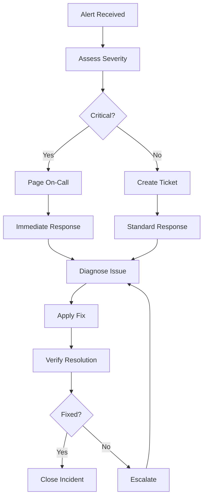

# Troubleshooting Runbook - Reddit Sentiment Analysis Pipeline

## Overview

This runbook provides comprehensive troubleshooting procedures for the Reddit Sentiment Analysis Pipeline. It covers common issues, their root causes, diagnostic steps, and resolution procedures for production environments.

## Quick Reference - Common Issues

| Issue Category | Symptoms | Quick Check | Page Reference |
|---|---|---|---|
| Service Down | 500 errors, no response | `curl http://localhost:8000/health` | [Service Issues](#service-issues) |
| High Memory | OOM kills, slow response | `docker stats` | [Resource Issues](#resource-issues) |
| Data Pipeline | Missing data, stale metrics | Check Redis queue depth | [Pipeline Issues](#pipeline-issues) |
| Database | Connection errors | `psql -h localhost -U reddit_user` | [Database Issues](#database-issues) |
| Authentication | 401/403 errors | Check JWT tokens | [Auth Issues](#authentication-issues) |

## Incident Response Workflow



## Service Issues

### 1. API Service Not Responding

**Symptoms:**
- HTTP 500/502/503 errors
- Connection timeouts
- Health check failures

**Diagnostic Steps:**

```bash
# Check service status
kubectl get pods -l app=reddit-sentiment-api
docker ps | grep reddit-sentiment

# Check service logs
kubectl logs -l app=reddit-sentiment-api --tail=100
docker logs reddit-sentiment-api

# Check resource usage
kubectl top pods
docker stats

# Test health endpoint
curl -v http://localhost:8000/health
curl -v http://localhost:8000/metrics
```

**Common Causes & Solutions:**

#### Out of Memory (OOM)
```bash
# Check for OOM kills
dmesg | grep -i "killed process"
kubectl describe pod <pod-name> | grep -i oom

# Solution: Increase memory limits
kubectl patch deployment reddit-sentiment-api -p '{"spec":{"template":{"spec":{"containers":[{"name":"api","resources":{"limits":{"memory":"2Gi"}}}]}}}}'
```

#### Database Connection Pool Exhausted
```bash
# Check connection count
psql -h localhost -U reddit_user -d reddit_sentiment -c "SELECT count(*) FROM pg_stat_activity;"

# Solution: Restart API service or increase pool size
kubectl rollout restart deployment/reddit-sentiment-api
```

#### High CPU Usage
```bash
# Check CPU metrics
kubectl top pods
htop

# Solution: Scale horizontally
kubectl scale deployment reddit-sentiment-api --replicas=3
```

### 2. Data Collector Service Issues

**Symptoms:**
- No new data in database
- Reddit API rate limit errors
- Stale sentiment scores

**Diagnostic Steps:**

```bash
# Check collector status
kubectl logs -l app=reddit-data-collector --tail=50
docker logs reddit-data-collector

# Check Reddit API connectivity
curl -H "User-Agent: reddit-sentiment-bot/1.0" https://api.reddit.com/r/test/hot.json

# Check queue depth
redis-cli llen reddit:posts:queue
redis-cli llen reddit:comments:queue
```

**Common Causes & Solutions:**

#### Reddit API Rate Limiting
```bash
# Check rate limit headers in logs
grep -i "rate.*limit" /var/log/reddit-collector.log

# Solution: Implement exponential backoff
# Edit collector configuration
kubectl edit configmap reddit-collector-config
# Update rate_limit_delay: 2.0 (seconds)
```

#### Invalid Reddit API Credentials
```bash
# Check credentials
kubectl get secret reddit-api-credentials -o yaml

# Update credentials
kubectl create secret generic reddit-api-credentials \
  --from-literal=client_id=your_client_id \
  --from-literal=client_secret=your_client_secret \
  --from-literal=username=your_username \
  --from-literal=password=your_password \
  --dry-run=client -o yaml | kubectl apply -f -
```

#### Network Connectivity Issues
```bash
# Test DNS resolution
nslookup api.reddit.com
dig api.reddit.com

# Test HTTPS connectivity
openssl s_client -connect api.reddit.com:443 -servername api.reddit.com
```

## Resource Issues

### 1. High Memory Usage

**Symptoms:**
- Pods getting OOMKilled
- Slow response times
- Memory alerts firing

**Diagnostic Steps:**

```bash
# Check memory usage
kubectl top nodes
kubectl top pods --sort-by=memory
free -h
cat /proc/meminfo

# Check for memory leaks
docker exec -it <container> python -c "
import psutil
import gc
gc.collect()
print(f'Memory usage: {psutil.virtual_memory().percent}%')
"
```

**Solutions:**

#### Immediate Response
```bash
# Scale down non-critical services
kubectl scale deployment reddit-dashboard --replicas=0

# Restart high-memory pods
kubectl delete pod -l app=reddit-sentiment-api

# Clear caches
redis-cli flushdb
```

#### Long-term Solutions
```bash
# Increase memory limits
kubectl patch deployment reddit-sentiment-api -p '{"spec":{"template":{"spec":{"containers":[{"name":"api","resources":{"limits":{"memory":"4Gi"},"requests":{"memory":"2Gi"}}}]}}}}'

# Add horizontal pod autoscaler
kubectl autoscale deployment reddit-sentiment-api --cpu-percent=70 --min=2 --max=10
```

### 2. High CPU Usage

**Symptoms:**
- Slow API responses
- High load averages
- CPU alerts firing

**Diagnostic Steps:**

```bash
# Check CPU usage
top -c
htop
kubectl top nodes
kubectl top pods --sort-by=cpu

# Identify CPU-intensive processes
ps aux --sort=-%cpu | head -10
```

**Solutions:**

```bash
# Scale horizontally
kubectl scale deployment reddit-sentiment-api --replicas=5

# Optimize sentiment analysis
# Reduce model complexity or use GPU acceleration
kubectl label nodes node-1 gpu=true
kubectl patch deployment sentiment-model -p '{"spec":{"template":{"spec":{"nodeSelector":{"gpu":"true"}}}}}'
```

## Pipeline Issues

### 1. Data Processing Delays

**Symptoms:**
- Increasing queue depths
- Stale sentiment scores
- Processing lag alerts

**Diagnostic Steps:**

```bash
# Check queue depths
redis-cli llen reddit:posts:queue
redis-cli llen reddit:comments:queue
redis-cli llen reddit:failed:queue

# Check processing rates
redis-cli get reddit:stats:processed_count
redis-cli get reddit:stats:failed_count

# Check worker status
kubectl get pods -l app=sentiment-worker
docker ps | grep sentiment-worker
```

**Solutions:**

#### Scale Processing Workers
```bash
# Increase worker replicas
kubectl scale deployment sentiment-workers --replicas=10

# Add dedicated processing nodes
kubectl label nodes worker-node-1 workload=processing
kubectl patch deployment sentiment-workers -p '{"spec":{"template":{"spec":{"nodeSelector":{"workload":"processing"}}}}}'
```

#### Optimize Processing
```bash
# Batch processing optimization
kubectl set env deployment/sentiment-workers BATCH_SIZE=100

# Use faster models for real-time processing
kubectl set env deployment/sentiment-workers MODEL_TYPE=fast
```

### 2. Data Quality Issues

**Symptoms:**
- Inconsistent sentiment scores
- Missing data fields
- Validation errors

**Diagnostic Steps:**

```bash
# Check data validation logs
kubectl logs -l app=data-validator --tail=100
grep -i "validation.*error" /var/log/reddit-pipeline.log

# Check database data quality
psql -h localhost -U reddit_user -d reddit_sentiment -c "
SELECT 
  COUNT(*) as total_posts,
  COUNT(CASE WHEN sentiment_score IS NULL THEN 1 END) as missing_sentiment,
  COUNT(CASE WHEN confidence_score < 0.5 THEN 1 END) as low_confidence
FROM reddit_posts 
WHERE created_at > NOW() - INTERVAL '1 hour';
"
```

**Solutions:**

```bash
# Reprocess failed items
redis-cli smembers reddit:failed:items | xargs -I {} redis-cli lpush reddit:reprocess:queue {}

# Update validation rules
kubectl edit configmap data-validation-rules

# Reset processing pipeline
kubectl rollout restart deployment/sentiment-workers
```

## Database Issues

### 1. Connection Pool Exhaustion

**Symptoms:**
- "connection pool exhausted" errors
- Timeouts connecting to database
- High connection count

**Diagnostic Steps:**

```bash
# Check current connections
psql -h localhost -U reddit_user -d reddit_sentiment -c "
SELECT count(*) as connections, state 
FROM pg_stat_activity 
GROUP BY state;
"

# Check connection limits
psql -h localhost -U reddit_user -d reddit_sentiment -c "SHOW max_connections;"

# Check long-running queries
psql -h localhost -U reddit_user -d reddit_sentiment -c "
SELECT pid, now() - pg_stat_activity.query_start AS duration, query 
FROM pg_stat_activity 
WHERE (now() - pg_stat_activity.query_start) > interval '5 minutes';
"
```

**Solutions:**

```bash
# Kill long-running queries
psql -h localhost -U reddit_user -d reddit_sentiment -c "
SELECT pg_terminate_backend(pid) 
FROM pg_stat_activity 
WHERE (now() - pg_stat_activity.query_start) > interval '10 minutes';
"

# Increase connection limits (temporary)
psql -h localhost -U reddit_user -d reddit_sentiment -c "ALTER SYSTEM SET max_connections = 200;"
psql -h localhost -U reddit_user -d reddit_sentiment -c "SELECT pg_reload_conf();"

# Restart services to reset connection pools
kubectl rollout restart deployment/reddit-sentiment-api
```

### 2. Database Performance Issues

**Symptoms:**
- Slow query responses
- High database CPU
- Lock contention

**Diagnostic Steps:**

```bash
# Check slow queries
psql -h localhost -U reddit_user -d reddit_sentiment -c "
SELECT query, mean_time, calls, total_time 
FROM pg_stat_statements 
ORDER BY total_time DESC 
LIMIT 10;
"

# Check for locks
psql -h localhost -U reddit_user -d reddit_sentiment -c "
SELECT blocked_locks.pid AS blocked_pid,
       blocked_activity.usename AS blocked_user,
       blocking_locks.pid AS blocking_pid,
       blocking_activity.usename AS blocking_user,
       blocked_activity.query AS blocked_statement,
       blocking_activity.query AS current_statement_in_blocking_process
FROM pg_catalog.pg_locks blocked_locks
JOIN pg_catalog.pg_stat_activity blocked_activity ON blocked_activity.pid = blocked_locks.pid
JOIN pg_catalog.pg_locks blocking_locks ON blocking_locks.locktype = blocked_locks.locktype
JOIN pg_catalog.pg_stat_activity blocking_activity ON blocking_activity.pid = blocking_locks.pid
WHERE NOT blocked_locks.granted;
"
```

**Solutions:**

```bash
# Analyze and optimize queries
psql -h localhost -U reddit_user -d reddit_sentiment -c "ANALYZE;"

# Add missing indexes
psql -h localhost -U reddit_user -d reddit_sentiment -c "
CREATE INDEX CONCURRENTLY idx_reddit_posts_created_at ON reddit_posts(created_at);
CREATE INDEX CONCURRENTLY idx_reddit_posts_subreddit ON reddit_posts(subreddit);
"

# Vacuum database
psql -h localhost -U reddit_user -d reddit_sentiment -c "VACUUM ANALYZE;"
```

## Authentication Issues

### 1. JWT Token Problems

**Symptoms:**
- 401 Unauthorized errors
- Token validation failures
- Authentication timeouts

**Diagnostic Steps:**

```bash
# Check JWT token validity
curl -H "Authorization: Bearer $TOKEN" http://localhost:8000/api/v1/user/profile

# Decode JWT token
echo $TOKEN | cut -d. -f2 | base64 -d | jq .

# Check token expiration
python3 -c "
import jwt
import os
token = os.environ.get('TOKEN')
decoded = jwt.decode(token, options={'verify_signature': False})
print(f'Expires: {decoded.get(\"exp\")}')
import time
print(f'Current: {int(time.time())}')
"
```

**Solutions:**

```bash
# Refresh expired tokens
curl -X POST http://localhost:8000/auth/refresh \
  -H "Content-Type: application/json" \
  -d '{"refresh_token": "'$REFRESH_TOKEN'"}'

# Reset JWT secret (affects all users)
kubectl create secret generic jwt-secret \
  --from-literal=secret=$(openssl rand -base64 32) \
  --dry-run=client -o yaml | kubectl apply -f -

# Restart auth service
kubectl rollout restart deployment/reddit-auth-service
```

### 2. Redis Session Issues

**Symptoms:**
- Session not found errors
- Frequent re-authentication required
- Session data corruption

**Diagnostic Steps:**

```bash
# Check Redis connectivity
redis-cli ping

# Check session data
redis-cli get "session:$SESSION_ID"
redis-cli ttl "session:$SESSION_ID"

# Check Redis memory usage
redis-cli info memory
```

**Solutions:**

```bash
# Clear corrupted sessions
redis-cli flushdb

# Increase session TTL
redis-cli config set timeout 7200

# Restart Redis if needed
kubectl rollout restart deployment/redis
```

## Monitoring and Alerting Issues

### 1. Prometheus Not Scraping Metrics

**Symptoms:**
- Missing metrics in Grafana
- Prometheus targets down
- Outdated metric values

**Diagnostic Steps:**

```bash
# Check Prometheus targets
curl http://localhost:9090/api/v1/targets

# Check service discovery
kubectl get endpoints
kubectl get services

# Check metric endpoints
curl http://localhost:8000/metrics
curl http://localhost:8001/metrics
```

**Solutions:**

```bash
# Restart Prometheus
kubectl rollout restart deployment/prometheus

# Update service monitors
kubectl apply -f monitoring/servicemonitor.yaml

# Check firewall rules
sudo iptables -L | grep 9090
```

### 2. Grafana Dashboard Issues

**Symptoms:**
- Dashboards not loading
- No data in panels
- Authentication failures

**Diagnostic Steps:**

```bash
# Check Grafana logs
kubectl logs -l app=grafana --tail=50

# Test Grafana API
curl -u admin:admin http://localhost:3000/api/health

# Check data sources
curl -u admin:admin http://localhost:3000/api/datasources
```

**Solutions:**

```bash
# Reset Grafana admin password
kubectl exec -it $(kubectl get pod -l app=grafana -o jsonpath='{.items[0].metadata.name}') -- \
  grafana-cli admin reset-admin-password newpassword

# Reimport dashboards
kubectl apply -f grafana/dashboard-configmap.yaml
kubectl rollout restart deployment/grafana
```

## Network and Connectivity Issues

### 1. Service-to-Service Communication

**Symptoms:**
- Connection refused errors
- DNS resolution failures
- Intermittent connectivity

**Diagnostic Steps:**

```bash
# Test DNS resolution
kubectl exec -it $(kubectl get pod -l app=reddit-sentiment-api -o jsonpath='{.items[0].metadata.name}') -- \
  nslookup reddit-database

# Test connectivity
kubectl exec -it $(kubectl get pod -l app=reddit-sentiment-api -o jsonpath='{.items[0].metadata.name}') -- \
  telnet reddit-database 5432

# Check network policies
kubectl get networkpolicies
```

**Solutions:**

```bash
# Update service definitions
kubectl apply -f k8s/services.yaml

# Check and fix network policies
kubectl delete networkpolicy --all  # Temporary fix
kubectl apply -f k8s/network-policies.yaml

# Restart networking
kubectl rollout restart daemonset/kube-proxy -n kube-system
```

## Performance Optimization

### 1. Query Optimization

```sql
-- Add missing indexes
CREATE INDEX CONCURRENTLY idx_reddit_posts_sentiment_score ON reddit_posts(sentiment_score);
CREATE INDEX CONCURRENTLY idx_reddit_posts_compound ON reddit_posts(subreddit, created_at, sentiment_score);

-- Update table statistics
ANALYZE reddit_posts;
ANALYZE reddit_comments;

-- Optimize frequent queries
EXPLAIN ANALYZE SELECT * FROM reddit_posts 
WHERE subreddit = 'python' 
AND created_at > NOW() - INTERVAL '1 day' 
ORDER BY sentiment_score DESC 
LIMIT 100;
```

### 2. Caching Optimization

```bash
# Optimize Redis configuration
redis-cli config set maxmemory-policy allkeys-lru
redis-cli config set maxmemory 2gb

# Implement cache warming
kubectl create job cache-warmer --image=reddit-sentiment-api:latest -- \
  python -c "import cache_warmer; cache_warmer.warm_popular_queries()"
```

## Escalation Procedures

### Severity Levels

**P0 - Critical (Page immediately)**
- Complete service outage
- Data loss or corruption
- Security breach

**P1 - High (Respond within 1 hour)**
- Major feature not working
- Performance severely degraded
- Multiple users affected

**P2 - Medium (Respond within 4 hours)**
- Minor feature issues
- Single user affected
- Non-critical errors

**P3 - Low (Respond within 24 hours)**
- Enhancement requests
- Documentation issues
- Non-urgent maintenance

### Contact Information

```bash
# On-call escalation
primary_oncall="john.doe@company.com"
secondary_oncall="jane.smith@company.com"
escalation_manager="manager@company.com"

# Slack channels
#incidents      # Primary incident response
#engineering    # Technical discussions
#management     # Leadership updates
```

## Recovery Procedures

### 1. Database Recovery

```bash
# Point-in-time recovery
pg_restore --host=localhost --username=reddit_user --dbname=reddit_sentiment_recovered \
  --verbose /backups/reddit_sentiment_$(date +%Y%m%d).dump

# Verify data integrity
psql -h localhost -U reddit_user -d reddit_sentiment_recovered -c "
SELECT COUNT(*) FROM reddit_posts;
SELECT MAX(created_at) FROM reddit_posts;
"
```

### 2. Service Recovery

```bash
# Full stack restart
kubectl delete pods --all
kubectl rollout restart deployment --all

# Gradual recovery
kubectl scale deployment reddit-sentiment-api --replicas=1
# Wait and verify
kubectl scale deployment reddit-sentiment-api --replicas=3
```

## Maintenance Windows

### Scheduled Maintenance

```bash
# Pre-maintenance checklist
- [ ] Notify users 48 hours in advance
- [ ] Backup all data
- [ ] Test rollback procedures
- [ ] Prepare monitoring

# During maintenance
kubectl patch deployment reddit-sentiment-api -p '{"spec":{"replicas":0}}'
# Perform updates
kubectl patch deployment reddit-sentiment-api -p '{"spec":{"replicas":3}}'

# Post-maintenance verification
curl http://localhost:8000/health
curl http://localhost:8000/api/v1/sentiment/test
```

---

This troubleshooting runbook provides comprehensive guidance for diagnosing and resolving issues in the Reddit Sentiment Analysis Pipeline. Regular updates should be made based on new issues encountered and lessons learned from incidents.
